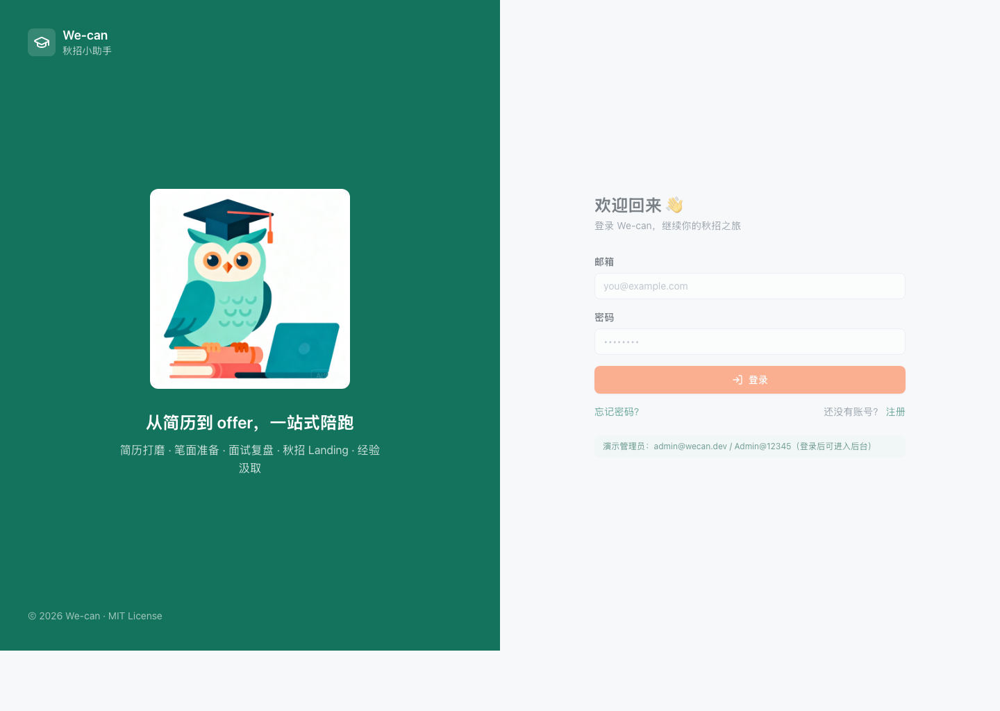
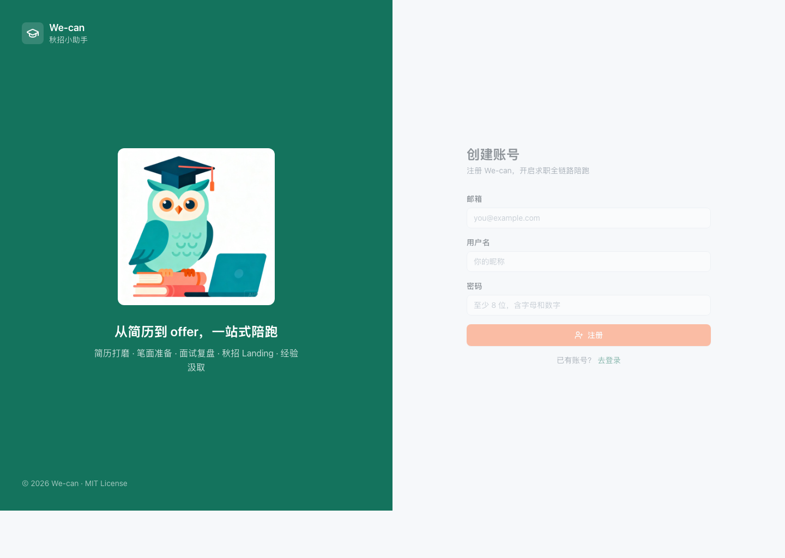
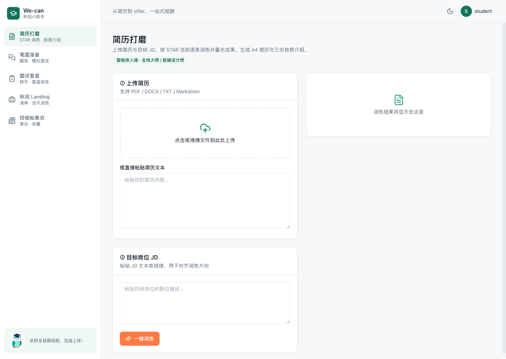
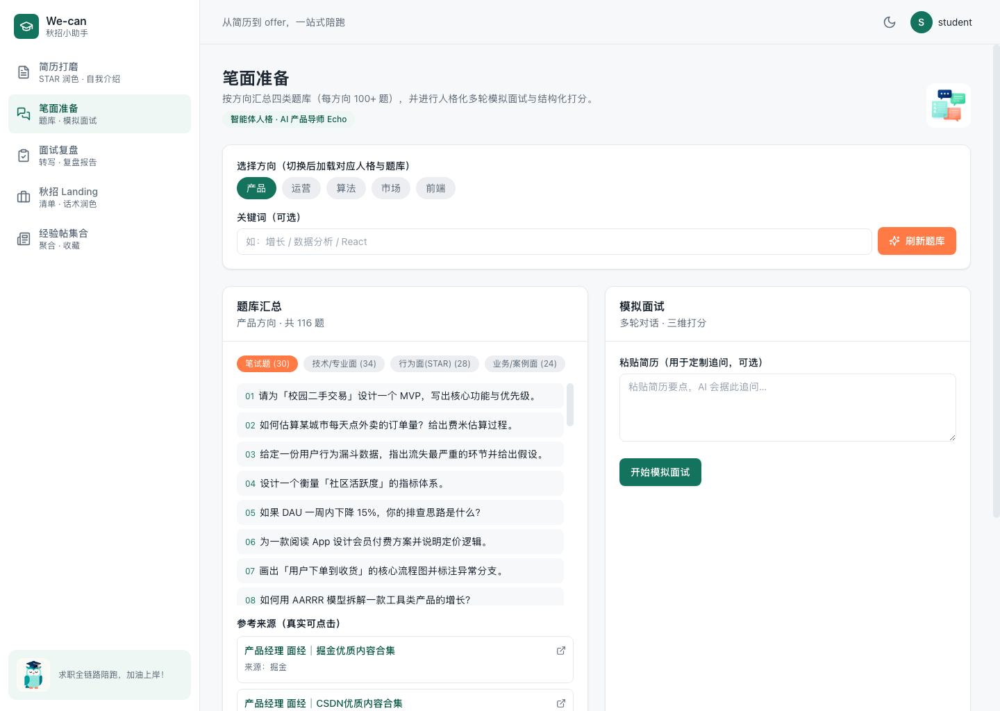
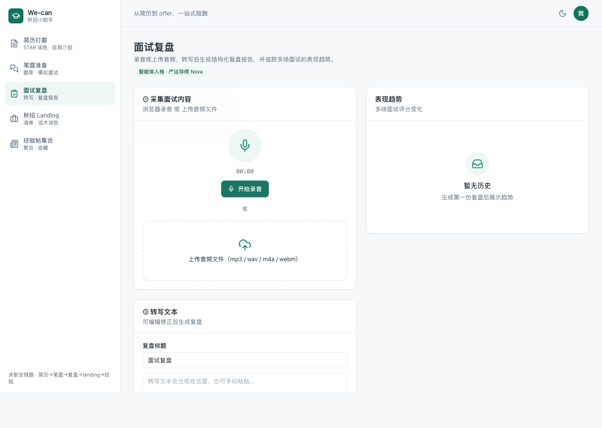
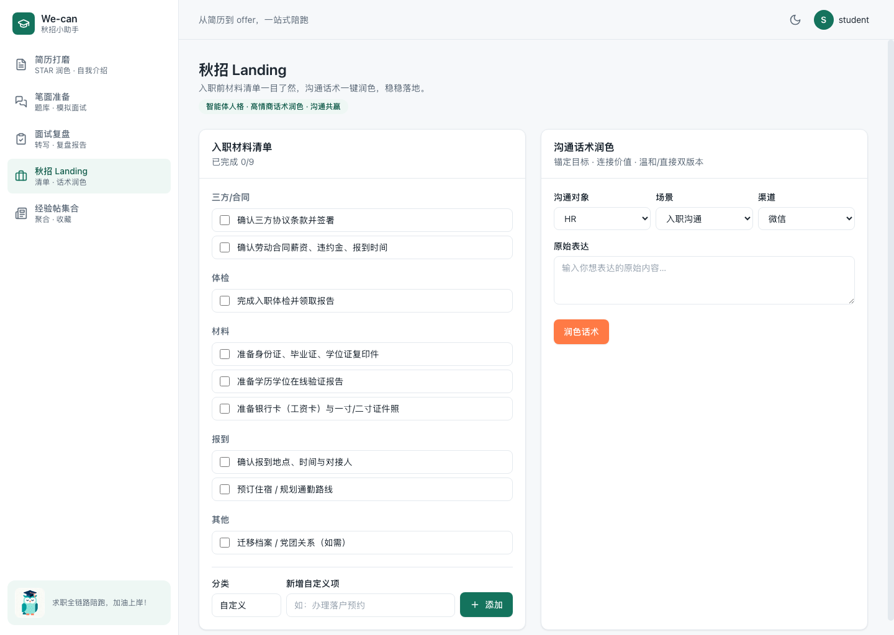
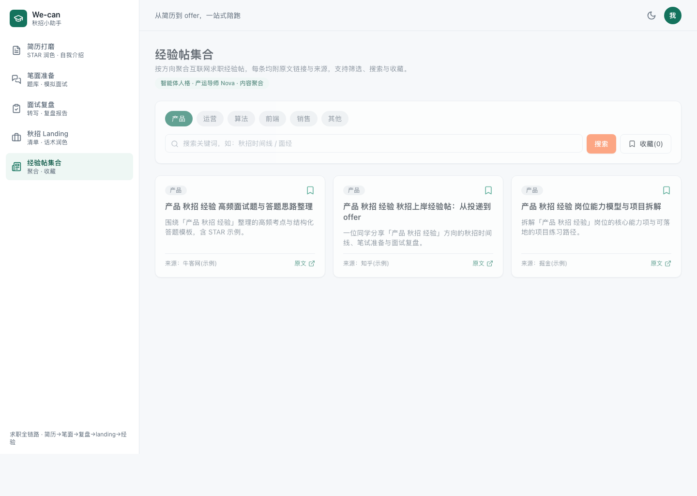
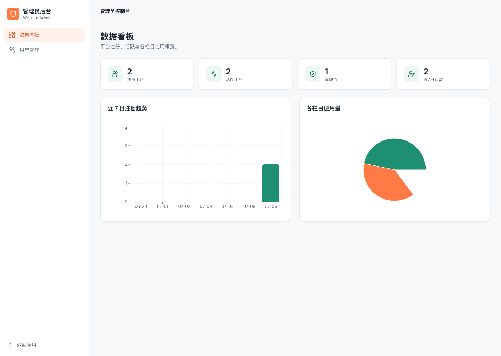
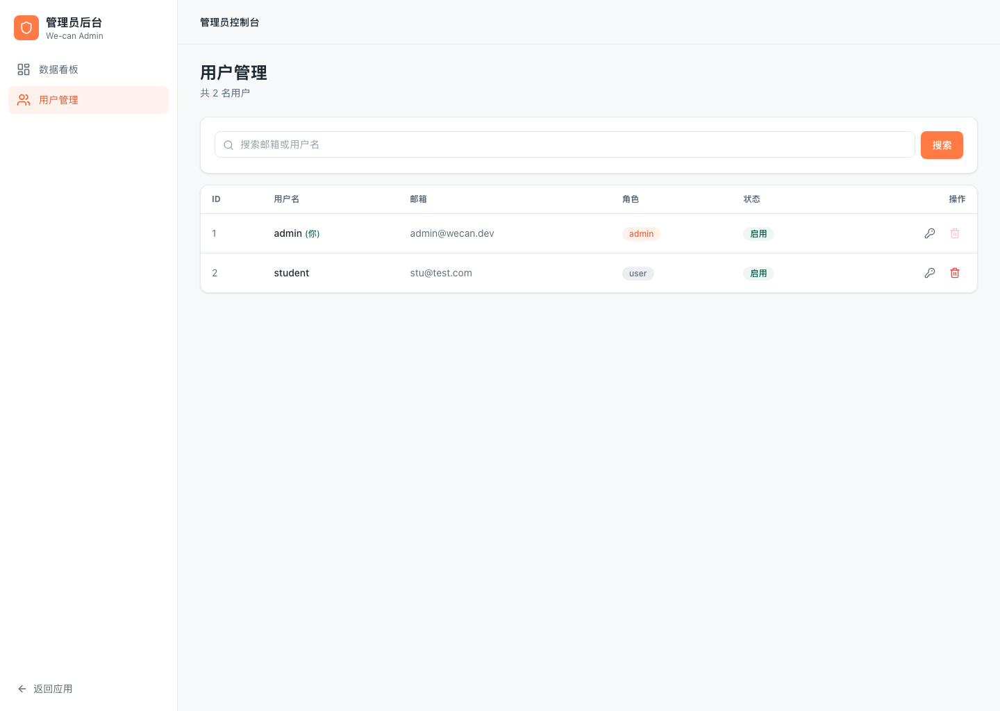

# We-can · 秋招小助手 🎓

> 覆盖求职全链路（**简历打磨 → 笔面准备 → 面试复盘 → 秋招 Landing → 经验汲取**）的网页版小助手，
> 带**账号体系**与**管理员后台**，界面精致无 AI 味，默认 mock 即可离线跑通完整 demo。

## ✨ 亮点（v2）

- 🔐 **完整鉴权**：注册 / 登录 / 刷新 / 登出 / 找回密码 / **登录态修改密码**（校验旧密码并吊销其他会话），JWT（access+refresh）+ bcrypt 哈希，路由守卫。
- 🛡️ **管理员后台**：数据看板（Recharts）+ 用户管理（搜索/分页/启用禁用/改角色/重置密码/删除），前后端双重校验。
- 🎭 **人格化笔面准备**：产品/运营/算法/市场/前端/后端/销售**七方向切换器**，切换后加载对应智能体人格（Echo / Nova / 全栈大师 / 前端设计师 / 后端架构师 Atlas / 销售增长教练 Vega）。
- 📚 **题库量达标**：每方向 **116 题**（笔试 / 技术面 / 行为面 STAR / 业务面 四类，7 方向合计 812）。
- 🔗 **真实经验帖**：每方向 **55 条**、多平台来源（掘金 / CSDN / SegmentFault 思否 / 人人都是产品经理）。全部经 **HTTP 200 可达性校验、可点击打开、无死链**（7 方向合计 385）。
- 🖼️ **seeddream 品牌素材**：吉祥物 / 空态 / 错误态 / 头图，均由 `ark-cli seeddream` 生成并落地到前端。
- 🧩 **数据隔离**：用户只见自己的简历 / 复盘 / 清单 / 收藏。
- 🔔 **交互反馈闭环**：全局 Toast 提示（成功/失败/信息）贯穿收藏、清单、润色、复盘、模拟面试等操作；经验帖支持**按来源筛选**（全部 / 掘金 / CSDN / …）。

## 🗂️ 五个栏目

| 栏目 | 能力 |
| --- | --- |
| 简历打磨 | 解析 → STAR 逐条润色 + 量化建议 → A4 简历导出 → 5/2/1 分钟自我介绍 |
| 笔面准备 | 七方向切换人格 + 四类题库（116/方向）+ 简历定制追问 + 多轮模拟面试三维打分 |
| 面试复盘 | 录音/上传 → 转写 → 复盘报告（时间线/优劣/行动项）→ 表现趋势图 |
| 秋招 Landing | 入职材料 checklist（持久化/自定义）+ 话术润色（温和/直接双版本） |
| 经验帖集合 | 多源真实经验帖（55/方向）+ 方向筛选 + 搜索 + 收藏，均带原文链接 |

## 🖼️ 界面预览

| 登录 | 注册 |
| --- | --- |
|  |  |

| 简历打磨 | 笔面准备 |
| --- | --- |
|  |  |

| 面试复盘 | 秋招 Landing |
| --- | --- |
|  |  |

| 经验帖集合 | 管理员看板 |
| --- | --- |
|  |  |

| 用户管理 |
| --- |
|  |

## 🧱 技术栈

- **前端**：React 18 + TS + Vite · Tailwind + shadcn 风格 + Framer Motion · Zustand（auth/track/theme） · Recharts · react-router v6 · react-to-print · lucide-react
- **后端**：FastAPI (Python 3.11) + Pydantic v2 · SQLAlchemy 2.0 async · SQLite（可切 Postgres）
- **鉴权**：PyJWT（access+refresh）+ bcrypt + email-validator
- **能力接入**：`LLMProvider / SearchProvider / TranscriberProvider` 抽象，mock 默认，真实实现走 env
- **素材**：ark-cli seeddream（`scripts/gen_assets.sh`）
- **测试**：pytest（后端，关键 service ≥60%）· vitest + testing-library（前端）
- **工程**：Docker + docker-compose · GitHub Actions（lint + test + build）

## 🚀 本地启动

### 方式一：docker-compose

```bash
docker compose up --build
# 前端 http://localhost:5173  后端 http://localhost:8000/docs
```

### 方式二：手动

**后端**
```bash
cd backend
python3.11 -m venv .venv && source .venv/bin/activate   # 或 uv venv .venv
pip install -e ".[dev]"                                  # 或 uv pip install -e ".[dev]"
uvicorn app.main:app --reload --port 8000
```
**前端**
```bash
cd frontend
npm install
npm run dev        # http://localhost:5173（已配置 /api 代理到 :8000）
```

## 👤 默认管理员

首次启动自动种子管理员（可在 `.env` 覆盖）：

```
邮箱：admin@wecan.dev
密码：Admin@12345
```

> 登录后右上角头像菜单或侧边栏可进入「管理员后台」。**生产环境请务必修改默认密码。**

## ✅ 测试与质量

```bash
# 后端
cd backend && source .venv/bin/activate
ruff check app tests scripts && black --check app tests scripts
pytest --cov=app --cov-report=term-missing        # 覆盖率约 78%

# 前端
cd frontend
npm run lint && npm test && npm run build
```

## 🔧 环境变量（见 `.env.example`）

| 变量 | 默认 | 说明 |
| --- | --- | --- |
| `DATABASE_URL` | sqlite 文件 | 可切 Postgres |
| `JWT_SECRET` | 占位 | 生产必须替换为长随机串 |
| `ACCESS_TOKEN_EXPIRE_MINUTES` / `REFRESH_TOKEN_EXPIRE_DAYS` | 30 / 7 | 令牌有效期 |
| `ADMIN_EMAIL` / `ADMIN_PASSWORD` | admin@wecan.dev / Admin@12345 | 种子管理员 |
| `LLM_PROVIDER` / `SEARCH_PROVIDER` / `TRANSCRIBER_PROVIDER` | mock | 可切真实实现 |
| `VITE_API_BASE_URL` | http://localhost:8000 | 前端后端地址 |

> 所有密钥仅经环境变量注入，仓库不含真实密钥；缺省 mock 保证无密钥可跑通。

## 📁 目录结构

```
We-can/
├─ backend/app/{core,db,schemas,services,api/v1,providers,utils}  # 分层后端
│  ├─ core/security.py        # JWT + bcrypt
│  ├─ api/v1/{auth,admin,resume,prep,review,landing,experience}.py
│  └─ db/seeds/               # questionbank.json / experiences.json（随仓库交付）
├─ frontend/src/{pages/{auth,admin,...},layouts,components,store,api,theme,assets/generated}
├─ docs/  (ARCHITECTURE / API / AUTH / DESIGN / SKILLS + screenshots)
├─ scripts/  (build_experiences.py / build_questionbank.py / gen_assets.sh)
├─ docker-compose.yml · .github/workflows/ci.yml
```

更多：[架构](docs/ARCHITECTURE.md) · [API](docs/API.md) · [鉴权](docs/AUTH.md) · [设计/素材](docs/DESIGN.md) · [Skills](docs/SKILLS.md)

## 📄 License

[MIT](LICENSE)
